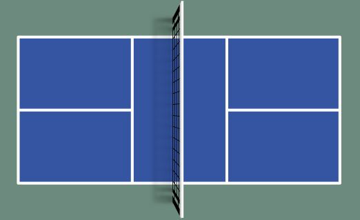

# 

# Racquet Sports

## The Pickleball Experience: A One Year Journey

**Author:** Kevin Leung

**Date:**  2024/02/27

#

**Contents:**

1. Background
   
2. Objective
   
3. Data Details
   
4. Visualization
   
5. Insights and Recommendations

#

## 1. Background:

Towards the end of October 2024, I was exposed to pickleball by my brother in Texas who had already been playing for quite some time. Both of us had racquet sport backgrounds from when we were younger.  Early on I decided to log my sessions and some other metrics I thought were useful in a similar fashion as my workout routines. 

## 2. Objective:

My goal was to reach 1000 hours in this sport during a one-year period and see where that would take me in terms of expertise.

## 3. Data Details:

An early exploratory data analysis (EDA) rendition of the project using SQL and PowerBi.

[SQL](https://github.com/kleung157/Racquet_Sports_Personal_Project/blob/main/documents/preliminary_eda.sql)

[PowerBI](./images/bi_dashboard.png)

The most recent iteration of the project added data through Microsoft Excel and Tableau.

Metrics tracked: session_id, date, city, state, address, latitude, longitude, court_name, session_type, court_type, time_spent_mins, weekday

In total there were 417 sessions from November 2023 to January 2025. I excluded 2 sessions from the dataset because of a missed naming snake_case error during data input. Including those points do not create major deviations in the overall summation of data. Using the court names I logged, I used google maps to locate the latitude, longitude and address of each for geographical representation of the locations I visited. 

## 4. Visualization

https://public.tableau.com/views/pickleball_dashboard/ThePickleballExperience?:language=en-US&:sid=&:redirect=auth&:display_count=n&:origin=viz_share_link

## 5. Insights and Recommendations:

Aim for less than 2 hours a session. Ideally 1 to 1.5 hours to minimize overloading of mental and physical capabilities.

Spend more than 50% of sessions drilling at outdoor courts over recreational playing to focus on fundamental repetitions. 

Indoor courts (orlando_racquet_sports and clearone) sessions combined is 74 sessions. More consistent advanced competition indoors but outdoors allows for better drilling conditions.

Decrease number of sessions per month, anything close to the number of days in a month (30) is too much frequency for casual playing.

Summer months being hot meant less play time compared to winter where more likely to play. Summer could be spent training rather than playing.

Being based in Kissimmee, travelling a lot to dedicated pickleball courts is not as beneficial comparatively to setting up a net at oak_street_park tennis courts to drill.

Progress was linear when starting pickleball for the first time. Stagnancy or regression occurs around 3.5-4.0 level. Going beyond 4.0 requires more physical practice and mental strategy practice.
